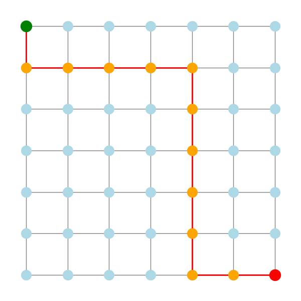

# 🧩 MazeSolver

## ✨ Descrição

O **MazeSolver** é um projeto para resolver labirintos representados como grafos, utilizando algoritmos clássicos de busca: **DFS** (Busca em Profundidade), **BFS** (Busca em Largura) e **A\*** (A Star). O sistema permite comparar o desempenho dos algoritmos e visualizar o caminho encontrado de forma gráfica.

---

## 🖼️ Exemplo de Solução

Veja abaixo um exemplo de caminho encontrado por um dos algoritmos:



*Solução encontrada pelo algoritmo A\**

---

## 🚀 Funcionalidades

- 🔎 Resolver labirintos modelados como grafos
- 🖼️ Visualizar o caminho encontrado no grafo usando gráficos
- ⚖️ Comparar diferentes algoritmos de busca

---

## 🛠️ Tecnologias

- 🐍 **Python** – implementação dos algoritmos e lógica do labirinto  
- 🕸️ **NetworkX** – representação e manipulação do grafo  
- 📊 **Matplotlib** – visualização gráfica do labirinto e do caminho  

---

## ▶️ Como usar

1. Instale as dependências:  
   ```bash
   pip install networkx matplotlib
   ```

2. Execute o projeto:

   ```bash
   python main.py
   ```

3. Siga as instruções no terminal para escolher o algoritmo e visualizar o resultado.

---

## 📚 Documentação dos Algoritmos

Consulte a pasta [`docs/`](./docs) para detalhes sobre cada algoritmo implementado:
- 🌟 [A*](docs/a_star.md)
- 🌊 [BFS](docs/bfs.md)
- 🌲 [DFS](docs/dfs.md)